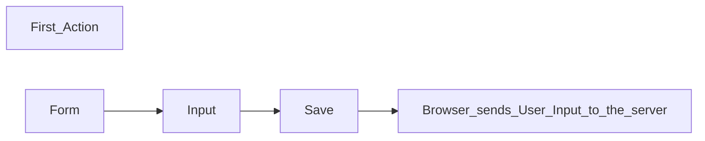
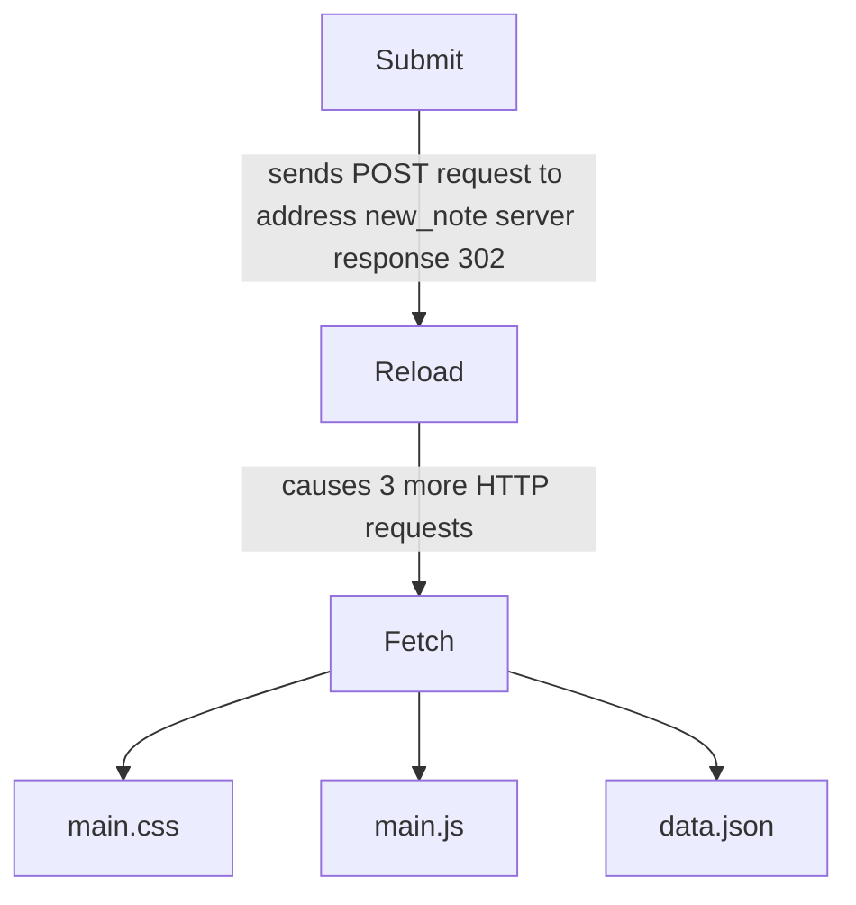

# part0_excercise4

```mermaid
graph LR;
First_Action;

Form-->Input --> Save --> Browser_sends_User_Input_to_the_server;
```
Submitting the Form Causes 5 HTTP requests.

```mermaid
graph TD;
  Submit -->|sends POST request to address new_note server response 302| Reload;
  Reload -->|causes 3 more HTTP requests|Fetch;
  Fetch --> main.css;
  Fetch --> main.js;
  Fetch --> data.json;
```
