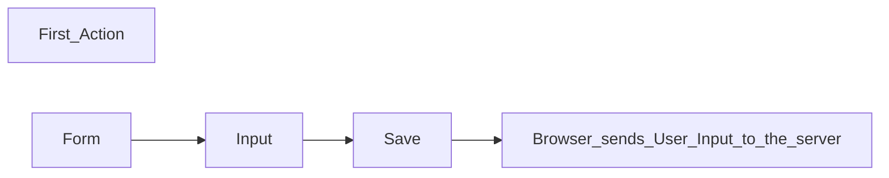

# part0_excercise4

Submitting the Form Causes 5 HTTP requests.

```mermaid
graph TD;
sequenceDiagram
  participant Submit
  participant Reload
  participant main.css
  participant main.js
  participant data.json

  Submit ->> Reload: sends POST request to address new_note server response 302
  Reload ->>Fetch: causes 3 more HTTP requests
  Fetch ->> main.css
  Fetch ->> main.js
  Fetch ->> data.json
```
