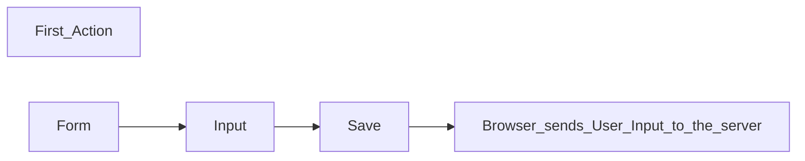
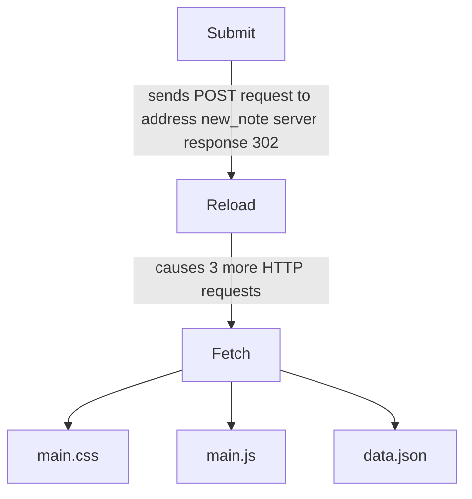
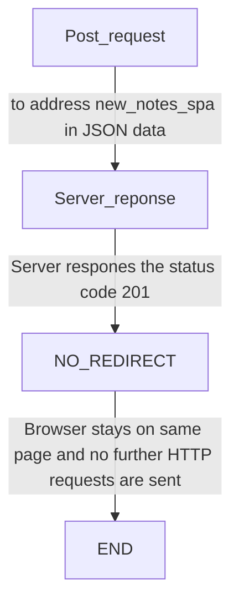

# part0

```mermaid
graph LR;
First_Action;

Form-->Input --> Save --> Browser_sends_User_Input_to_the_server;
```
Submitting the Form Causes 5 HTTP requests.

```mermaid
graph TD;
  Submit -->|sends POST request to address new_note server response 302| Reload;
  Reload -->|causes 3 more HTTP requests|Fetch;
  Fetch --> main.css;
  Fetch --> main.js;
  Fetch --> data.json;
```
# Single Page APP

  Form contains no Action or Method attribute;

```mermaid
  graph TD;
  Post_request--> |to address new_notes_spa in JSON data| Server_reponse;
  Server_reponse--> | Server respones the status code 201| NO_REDIRECT;
  NO_REDIRECT--> |Browser stays on same page and no further HTTP requests are sent| END;

```
